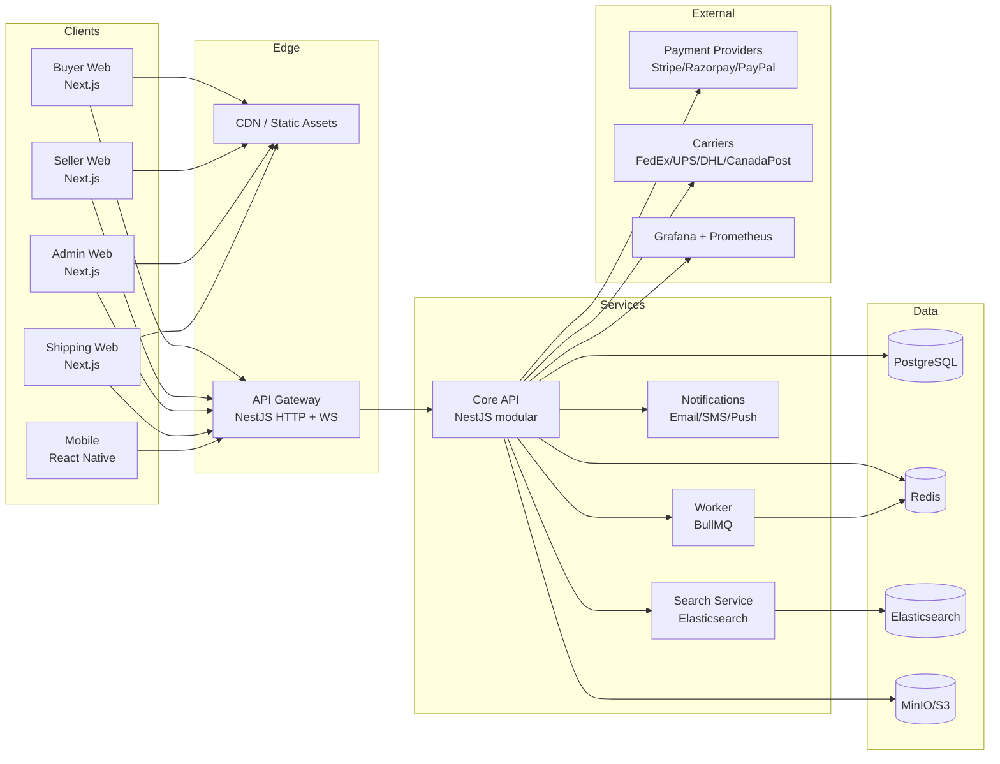

# Onsective — Master Build Plan

> Status: living document. Last revised 2026-05-17.
> Companion files: [`PROGRESS.md`](./PROGRESS.md), `phase-N.md`, `phase-N-debug.md`.

A four-portal, multi-region, in-house marketplace platform. This document plans the full eight-phase build before any code lands, so subsequent sessions can resume from `PROGRESS.md` without re-thinking scope.

---

## 1. Architecture at a Glance



### Cross-cutting choices

| Concern         | Choice                                                              | Why                                                                 |
| --------------- | ------------------------------------------------------------------- | ------------------------------------------------------------------- |
| Monorepo        | pnpm workspaces + Turborepo                                         | Fast, free, mature; first-class Next + Nest support                 |
| Language        | TypeScript strict                                                   | One language web→mobile→backend; shared types in `packages/shared-types` |
| API style       | REST + OpenAPI today, gRPC reserved for internal service-to-service | REST is web/mobile-friendly; OpenAPI generates `api-client`         |
| ORM             | Prisma                                                              | Type-safe, migration-first; works well with NestJS                  |
| Auth            | JWT access (15 m) + opaque refresh (30 d) in HttpOnly cookie        | Web + mobile + RBAC per portal                                      |
| Eventing        | BullMQ (Redis) + in-process `EventEmitter2`; gateway via Socket.IO  | No external broker until Phase 6                                    |
| Money           | Always **minor units (integer)** + ISO currency                     | Avoids float drift; `Money` helper in shared-types                  |
| IDs             | ULID (sortable, URL-safe)                                           | Better than UUIDv4 for index locality                               |
| Multi-tenancy   | Single DB, `sellerId`/`storeId` discriminator                       | Simpler ops at launch; partitioning available later                 |
| Time zones      | Store UTC, render local                                             | Required for multi-region                                           |

---

## 2. Phase Map

| Phase | Title                              | Deliverables                                                                                                  | Status |
| ----- | ---------------------------------- | ------------------------------------------------------------------------------------------------------------- | ------ |
| 1     | Foundation & MVP                   | Monorepo, auth, buyer storefront (browse → checkout), seller onboarding+listing, admin shell, mock+Stripe pay | 🟢 done |
| 2     | Shipping & Logistics               | Carrier abstraction, FedEx/UPS/DHL/CanadaPost adapters, label PDFs, shipping-partner portal, live tracking    | 🟢 done |
| 3     | Seller Power Tools                 | Bulk listing CSV, advanced inventory, analytics dashboards, subscription billing, listing-fee engine          | 🟢 done |
| 4     | Revenue & Advertising              | Sponsored listings, banner ad manager, commission automation, revenue reporting & payouts                     | 🟢 done |
| 5     | Compliance & Regulated Products    | Document verification workflows, age-gating, digital goods + license keys + secure download                   | 🟢 done |
| 6     | i18n & Scale Hardening             | Full localization, multi-currency display & FX, regional tax engines, k8s manifests, perf budgets             | 🟢 done |
| 7     | Mobile Apps                        | Expo React Native shell, full feature parity, push notifications, deep links, store-submission ready          | 🟢 done |
| 8     | Intelligence & Polish              | Search ranking, recommender, A/B testing, accessibility audit, launch readiness                               | 🟢 done |
| 9     | Marketplace Trust & Operations     | Returns + refunds, reviews + ratings, buyer-seller messaging, admin support inbox, disputes                   | 🟢 done |
| 10    | Buyer Growth Engine                | Promotions/coupons, wallet + store credit, wishlists + price-drop alerts, abandoned-cart recovery             | 🟢 done |
| 11    | Seller Success Suite               | Transactional email + per-category preferences, seller analytics, inventory forecasting, seller webhooks      | 🟢 done |
| 12    | Trust, Safety & Operations         | Order risk engine, account security + step-up, seller health score, observability (trace IDs, /metrics)       | 🟢 done |
| 13    | Onsective Fulfillment              | Multi-warehouse inventory, inbound shipments, zone-based order routing, pick lists, daily storage billing     | 🟢 done |
| 14    | Authenticity & Certified Refurb    | **Positioning pivot:** certified-only retail. Brand auth, refurbisher cert, per-unit refurb listings, warranty tiers, buyer trust UI | 🟢 done |
| 15    | Trade-in & Circular Loop           | Buyer trade-in quote → ship-back kit → refurbisher routing → grading → re-list as RefurbUnit (closes the loop) | 🟢 done |
| 16    | AI-assisted Auth & Grading         | Provider abstraction, heuristic default, model registry, inference runs, signals shown in auth/grade panels (humans still decide) | 🟢 done |
| 17    | Brand Storefronts                  | Curated brand sub-stores (hero, story, collections, live product feed). Inventory-holding or authorized-only modes — no drop-ship | 🟢 done |
| 18    | Returns Liquidation & Outlet       | Warehouse return inspection → disposition (outlet relist, regrade, dispose, return-to-seller). OPEN_BOX condition. Buyer outlet | 🟢 done |
| 19    | Repair Network & Service Tickets   | Verified RepairPartners, ServiceTicket lifecycle, warranty-driven routing, completion writes WarrantyClaim | 🟢 done |
| 20    | Sustainability & Trade Reporting   | Per-category factors, snapshotted impact events on circular actions, buyer/brand/platform totals, /impact + /account/impact pages | 🟢 done |
| 21    | Multi-warehouse Smart Routing & SLA | Per-item warehouse picks, per-destination SLA profiles, PDP "get it by" estimates, breach scheduler emits seller-health signals | 🟢 done |
| 22    | Loyalty & Membership               | Onsective Plus (paid annual) + points ledger earned on purchases/circular actions, redeemable to wallet, benefit gates on checkout/refurb/outlet | ✅ done |
| 23    | Recurring Billing & Saved Cards    | Stripe Subscriptions for Plus auto-renewal, PaymentMethod model + buyer page, webhook-driven membership renewal/pause/expire, MembershipBillingEvent audit log | ✅ done |
| 24    | Saved-Card Checkout & Plus Ops     | Off-session saved-card one-shot checkout (with 3DS reflow), Plus lifecycle emails (renewed/failed/expiring-soon/expired), admin Plus dashboard with MRR + churn KPIs | ✅ done |
| 25    | Buyer Referrals                    | Per-user referral codes, signup capture via ?ref=, first-paid-order payout to both sides in points, anti-fraud (self/same-address/same-IP/30d-limit), admin abuse review | ✅ done |
| 26    | Privacy, Data Export & Deletion    | GDPR/CCPA: async data-export builder with signed URL + 7d TTL, 30-day grace soft-deletion (anonymize PII in place, retain business records), Stripe customer detach, admin oversight | ✅ done |
| 27    | In-app Notification Center         | Database-backed feed for buyer-side events (Plus billing, referrals, orders, messaging), TopBar bell + unread badge (60s poll), /account/inbox with cursor pagination, internal `notification.created` event for future socket fan-out | ✅ done |
| 28    | SEO, Structured Data & Sitemaps    | Dynamic sitemap.xml (chunked index, product/brand/category/outlet files), robots.txt, schema.org JSON-LD on PDPs (Product/Offer/Brand) + brand pages (Organization + ItemList) + outlet (ItemList), OpenGraph + Twitter Cards, canonical URLs | ✅ done |
| 29    | Stripe Connect Seller Onboarding   | Express onboarding flow with hosted AccountLink, local mirror of Connect status via account.updated webhook, payout gate on payoutsEnabled, seller-web /seller/onboarding/payouts + persistent banner, admin Connect API (UI deferred) | ✅ done |
| 30    | Rate Limiting & Abuse Prevention   | Redis sliding-window limiter with in-memory fallback, @RateLimit decorator + RateLimitGuard, AbuseEvent + RateLimitBlock persistence, auto-escalation after repeat violations, coverage on 7 high-risk endpoints, admin /rate-limits page with block/unblock | ✅ done |
| 31    | Two-Factor Authentication (TOTP)   | RFC 6238 TOTP (hand-rolled, HMAC-SHA1, ±1 step + replay guard), AES-256-GCM secret-at-rest, argon2-hashed single-use recovery codes, mfaRequired login challenge, /auth/2fa/* endpoints, admin reset, /account/security UI on buyer-web + login challenge in all portals | ✅ done |
| 32    | Cookie Consent & Marketing Prefs   | ConsentRecord per identity (user XOR anon session), region detection (CF/Vercel/Fastly + Accept-Language), banner on every page with accept-all/reject/customize, /privacy/consent + /privacy/preferences + /privacy/unsubscribe endpoints, email service gates marketing kinds on consent, one-shot per-send unsubscribe tokens, /account/preferences master switches, /legal/cookies policy, admin metrics | ✅ done |
| 33    | WebAuthn / Passkeys                | Hand-rolled CBOR + COSE → KeyObject for ES256/RS256/EdDSA, registration + assertion ceremonies, counter replay guard, passwordless sign-in via discoverable credentials, passkey-as-2FA path that consumes the LOGIN challenge, admin reset, buyer-web /account/security PasskeysCard + login UI in all entry points | ✅ done |
| 34    | Account Recovery                   | Enumeration-safe password reset (1h single-use token, revokes sessions, never bypasses 2FA), 2FA-lockout recovery with 72h waiting window + reminder cadence + one-click cancel, recovery scheduler, admin oversight of in-flight recoveries, buyer-web /forgot-password + /reset-password + /account-recovery flow | ✅ done |
| 35    | Gift Cards & Store Credit          | Purchasable gift cards via Stripe PaymentIntent (giftCardId webhook routing), redeem-to-wallet with concurrent-claim guard, scheduled delivery, admin promo issuance + void, compliance-aware no-expiry default, buyer-web /gift-cards purchase + /account/gift-cards redeem, admin /gift-cards | ✅ done |
| 36    | Product Q&A                        | Shopper questions on product pages answered by sellers / verified owners / shoppers, snapshotted author-role badges, helpful-votes (one per user, toggle), asker notification on answer, rate-limited posting, admin moderation; PDP ProductQna component + buyer /account/qna + seller-web /qna + admin-web /qna | ✅ done |
| 37    | Subscribe & Save                   | Recurring product auto-delivery at a 5% standing discount; isolated OrdersService.createSubscriptionOrder (off-session Stripe charge, stranded-order rollback), env-gated AutoshipScheduler with 2-day-retry / 3-strike dunning, buyer skip/pause/resume/cancel; PDP SubscribeSave block + /account/subscriptions | ✅ done |
| 38    | Product Comparison                 | Server-side per-buyer comparison set (cap 4), side-by-side `/compare` table hydrated with price/condition/brand/seller/rating/stock + attribute-union rows, idempotent add; PDP CompareButton + top-bar link | ✅ done |
| 39    | Saved Searches                     | Persistent buyer search alerts with append-only SavedSearchHit dedupe and one summary notification per scan; Postgres ILIKE matcher (no ES dependency), env-gated hourly scheduler, /search Save-this-search button + /account/saved-searches | ✅ done |

---

## 3. Phase Detail

### Phase 1 — Foundation & MVP
Detailed in [`phase-1.md`](./phase-1.md). Highlights:
- Monorepo + tooling (Turbo, ESLint, Prettier, tsconfig base, Docker Compose)
- Postgres schema for: User, Address, Seller, Category, Product, ProductVariant, Media, Cart, CartItem, Order, OrderItem, Payment, AdminSetting
- Auth: email+password, JWT access + refresh rotation, RBAC (`BUYER`, `SELLER`, `ADMIN`, `SHIPPER`)
- Storefront: home, category browse, search (Postgres LIKE for Phase 1 — Elasticsearch lands Phase 6), PDP, cart, address, checkout, payment, order confirmation
- Seller: signup → store profile → product create with variants & images → orders queue
- Admin: dashboard, seller approval queue, commission % setting, order overview, settings
- Payments: provider-agnostic `PaymentGateway` interface with `MockProvider` (always works in dev) and `StripeProvider`
- Notifications: email via SMTP (transactional) wired through worker; SMS deferred to Phase 2

### Phase 2 — Shipping & Logistics
- `CarrierAdapter` interface: `quote`, `purchaseLabel`, `track`, `cancel`
- Adapters: FedEx, UPS, DHL Express, Canada Post; each behind a feature flag and adminable per-seller
- `ShippingRule` model: per-seller carrier whitelist, weight bands, free-shipping thresholds
- Label generation via headless Chromium (Puppeteer) → carrier-spec PDF
- Shipping-partner portal: pickup queue, scan-to-confirm, milestone updates push via Socket.IO
- Buyer tracking page (public token URL) + email/SMS milestone hooks
- Phase doc: `phase-2.md` with sequence diagrams for *quote → label → handoff → in-transit → delivered*

### Phase 3 — Seller Power Tools
- Bulk product import (CSV / XLSX) with row-level validation report
- Variant matrix editor; inventory reservations on cart-add (TTL 15 min)
- Seller analytics: revenue, AOV, conversion, top SKUs (materialized views refreshed nightly)
- Subscription tiers: `BASIC` (0/mo), `PRO` (29/mo), `ENTERPRISE` (199/mo); feature gating via `SubscriptionGuard`
- Listing-fee engine: per-seller, per-category overrides with audit log

### Phase 4 — Revenue & Advertising
- Ad placement primitives: `SponsoredProduct`, `SearchSponsor`, `BannerSlot`
- Bid model: CPC and CPM auctions resolved at request time (Redis sorted set)
- Commission engine: deducted at order-capture; `LedgerEntry` table for double-entry bookkeeping
- Payout pipeline: nightly job aggregates seller-net, generates payouts, Stripe Connect or manual SEPA file
- Admin revenue dashboard with cohort breakdowns

### Phase 5 — Compliance & Regulated Products
- `CategoryCompliance` rules: required documents, expiry, regulator
- Seller compliance workspace: upload, status, admin review queue, comments
- Age-gate component (date-of-birth + persisted consent token)
- Digital goods: `LicenseKeyPool`, signed-URL download (5-min TTL), re-download limit per buyer
- HSN/tariff codes per product (drives Phase 6 tax + Phase 2 customs labels)

### Phase 6 — i18n & Scale Hardening
- `next-intl` for web, `i18next` for mobile; translation source-of-truth in `packages/i18n`
- Multi-currency: prices stored in seller currency; converted at display via `FxRate` table refreshed hourly
- Tax engines: pluggable `TaxStrategy` per country; GST/HST/VAT/Sales/Consumption implementations
- Kubernetes manifests + Helm chart, horizontal pod autoscaler on API, read replicas for Postgres
- Performance: p95 PDP TTFB ≤ 250 ms, Lighthouse ≥ 90 mobile

### Phase 7 — Mobile Apps
- Expo SDK, shared `api-client` and `shared-types`
- Screens: onboarding, home, search, PDP, cart, checkout (Apple/Google Pay where possible), account, orders, tracking
- Push notifications via Expo Push (self-hosted FCM proxy as backup)
- Deep links + universal links
- Store-submission checklist: privacy manifest, ATT prompt, Play data-safety form

### Phase 8 — Intelligence & Polish
- ES relevance: BM25 + boost on conversion-rate and recency
- Recommendations: `frequently-bought-together`, `similar-to-this-PDP`, basic collaborative filter
- A/B framework: GrowthBook self-hosted, exposure events to Postgres
- Final accessibility & WCAG 2.1 AA audit
- Launch readiness: load test (k6), DR runbook, on-call rotation

---

## 4. Repository Layout (target)

```
ecommerce/
├── apps/
│   ├── buyer-web/        # Next.js 14 storefront
│   ├── seller-web/       # Next.js 14 seller portal
│   ├── admin-web/        # Next.js 14 Onsective admin
│   ├── shipping-web/     # Next.js 14 logistics partner portal (Phase 2)
│   └── mobile/           # Expo RN app (Phase 7)
├── packages/
│   ├── shared-types/     # Cross-cutting TS types (Money, ApiError, DTOs)
│   ├── api-client/       # Typed fetch wrapper
│   ├── ui/               # Premium design system (Tailwind + Radix primitives)
│   └── i18n/             # Locale catalogs (Phase 6)
├── services/
│   ├── api/              # NestJS HTTP + WS + workers
│   ├── search/           # ES indexer (Phase 6)
│   └── notifications/    # Email/SMS/Push worker (Phase 2 split)
├── infra/
│   ├── docker/           # Compose, Dockerfiles
│   ├── k8s/              # Helm charts (Phase 6)
│   └── grafana/          # Dashboards
├── doc/                  # Phase docs, debug reports, ADRs
└── scripts/              # one-off dev scripts (seed, fx-refresh, etc.)
```

---

## 5. Cross-Cutting NFR Budgets

- Availability: 99.9% by end of Phase 6
- p95 API latency: ≤ 200 ms for read endpoints, ≤ 500 ms for checkout
- Recovery: PITR Postgres, daily snapshots, 7-day retention
- Security: OWASP Top 10 scan pre-launch, dependency audit per phase, secrets only via env / sealed secrets

---

## 6. Decisions Log (rolling)

- **D-001 (Phase 1):** Use Prisma over TypeORM for schema-first migrations and tighter Next.js DX.
- **D-002 (Phase 1):** Money stored as integer minor units + ISO currency. Helper `Money.format(amount, currency, locale)` in shared-types.
- **D-003 (Phase 1):** Refresh tokens are opaque random strings hashed in DB (`sha256`); rotated on every use.
- **D-004 (Phase 1):** Cart belongs to a `userId` (authed) **or** a `guestToken` cookie; merged on login.
- **D-005 (Phase 1):** Search in Phase 1 is Postgres `pg_trgm` + ILIKE. ES integration deferred until catalog ≥ 50k SKUs (Phase 6).
- **D-006 (Phase 1):** Payment gateway is an abstract interface; `MockProvider` is default in dev so the entire checkout flow works without external keys.
- **D-007 (Phase 1):** ULIDs everywhere user-visible; UUIDs only internal where forced by libs.
- **D-008 (Phase 2):** Shipping label PDFs rendered server-side via React-PDF; no carrier-hosted label fallbacks.
- **D-009 (Phase 4):** Double-entry ledger from day one — every commission, payout, refund is two balanced rows.
- **D-010 (Phase 6):** Tax computed at order-create time and snapshotted on `OrderItem.taxAmountMinor` so historical orders never re-compute.

---

## 7. Risks & Mitigations

| Risk                                              | Mitigation                                                                 |
| ------------------------------------------------- | -------------------------------------------------------------------------- |
| Scope creep across 8 phases                       | Strict phase gates, feature flags, `PROGRESS.md` discipline                |
| Carrier API breakage                              | Adapter interface; mock adapter for tests; circuit breaker per carrier     |
| Payment provider downtime                         | Multi-provider abstraction; idempotency keys; saga-style order reconcile   |
| Multi-currency rounding bugs                      | Integer money + explicit rounding strategy in `Money.toMinor()`            |
| SEO for marketplace at scale                      | Next.js ISR + sitemap generator + structured data per PDP                  |
| Compliance (data residency, GDPR)                 | Region-scoped buckets, user-data export/delete endpoints from Phase 1      |

---

## 8. How to Resume

1. Open `doc/PROGRESS.md`.
2. Find the first unchecked checkbox under the current phase.
3. Do that item.
4. Tick it (`- [x] …`) with today's date.
5. If a whole phase finishes, write `doc/phase-N-debug.md` and bump the *Phase Map* table above.
