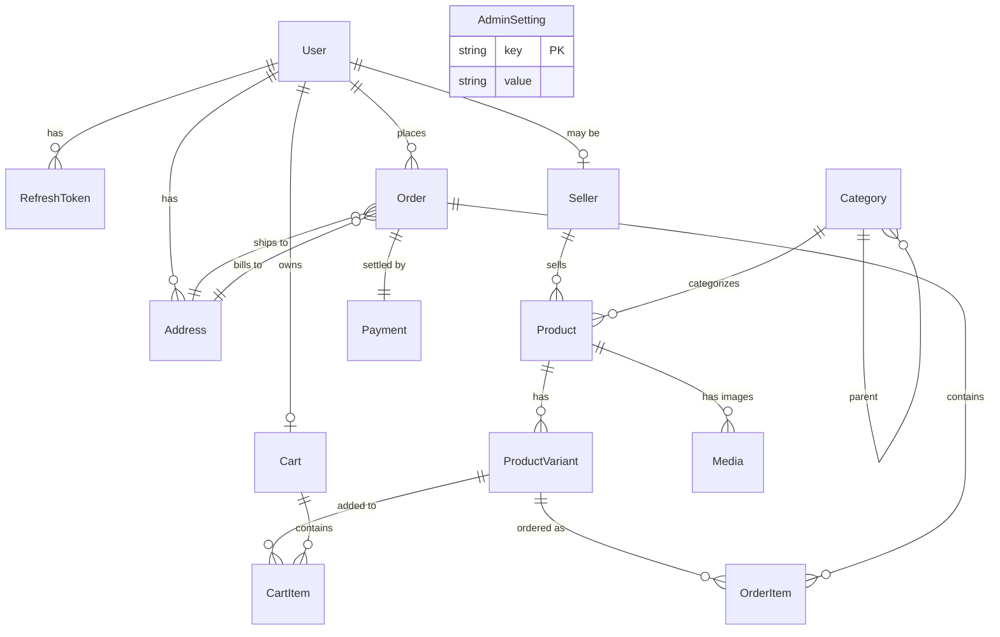

# Phase 1 — Foundation & MVP

> Companion: [`master-plan.md`](./master-plan.md), [`PROGRESS.md`](./PROGRESS.md), [`phase-1-debug.md`](./phase-1-debug.md)

## 1. Objectives

Ship a runnable end-to-end marketplace that proves the platform's spine:

1. A buyer can register, browse, search, view a PDP, add to cart, check out (mock payment), and see the placed order.
2. A seller can register, get approved, list a product with variants and images, and see incoming orders.
3. A platform admin can approve sellers, set the global commission, and inspect orders.
4. The platform runs locally with `docker compose up` for infra and `pnpm dev` for apps.

Out of scope (deferred): live carrier integrations, label PDFs, analytics dashboards, advertising, compliance workflows, i18n, mobile.

## 2. Scope

### Must-have
- Monorepo + base tooling
- Auth (email+password, JWT access + refresh rotation, RBAC)
- Catalog (categories, products with variants, media URLs)
- Cart (guest + authed, merge on login)
- Checkout → Order → Payment (Mock provider; Stripe stubbed behind real interface)
- Buyer storefront, Seller portal MVP, Admin shell
- OpenAPI documentation at `/docs`

### Nice-to-have (best-effort)
- Email transactional via SMTP/Mailhog
- Address book CRUD
- Search with Postgres trigram

### Deferred
- Real carrier APIs, label generation, Shipping Partner Portal (→ Phase 2)
- Subscription billing, analytics, bulk import (→ Phase 3)
- Sponsored listings, payouts (→ Phase 4)
- Compliance workflows (→ Phase 5)
- i18n, multi-currency conversion (→ Phase 6)
- Mobile apps (→ Phase 7)

## 3. Architecture Decisions (Phase-1 specific)

- **Monorepo:** pnpm workspaces + Turborepo.
- **API runtime:** NestJS, single deployable. Modules: `auth`, `users`, `sellers`, `catalog`, `cart`, `orders`, `payments`, `admin`, `media`, `health`.
- **DB:** PostgreSQL 16 via Prisma 5; one database, one schema.
- **Cache/queues:** Redis 7 via ioredis; BullMQ available but only used Phase 2+.
- **Object storage:** MinIO. Media table stores a key + bucket; clients request presigned URLs.
- **Auth:** JWT access token (HS256, 15-min TTL) returned in JSON; refresh token (opaque random 256-bit) stored in HttpOnly cookie + hashed in DB; rotated on each refresh.
- **RBAC:** Each user has a single primary `role` plus zero-or-one `Seller` profile. Guards: `@Roles('ADMIN')`, etc.
- **Money:** integer minor units (`priceMinor: number`) + ISO currency code. Conversion deferred to Phase 6.
- **Search:** Postgres `pg_trgm` + ILIKE; good for <50k SKUs.
- **Payment:** abstract `PaymentGateway` interface. `MockProvider` is the dev default; `StripeProvider` implemented but requires `STRIPE_SECRET_KEY`.
- **CORS:** allow-list driven from env (`BUYER_WEB_URL`, …).
- **IDs:** ULID (via `ulid` package).

## 4. Domain Model



### Key fields (excerpt)

- **User**: `id (ULID)`, `email (unique)`, `passwordHash`, `role (BUYER|SELLER|ADMIN|SHIPPER)`, `status (ACTIVE|PENDING|SUSPENDED)`, `firstName`, `lastName`, `phone?`, timestamps
- **RefreshToken**: `id`, `userId`, `tokenHash (sha256)`, `expiresAt`, `revokedAt?`, `userAgent`, `ip`
- **Seller**: `id`, `userId (unique)`, `storeName (unique slug)`, `displayName`, `status (PENDING|APPROVED|REJECTED|SUSPENDED)`, `commissionBps?` (overrides global), `payoutCurrency`
- **Category**: `id`, `slug (unique)`, `name`, `parentId?`, `position`
- **Product**: `id`, `sellerId`, `categoryId`, `slug`, `title`, `description`, `currency`, `basePriceMinor`, `status (DRAFT|ACTIVE|ARCHIVED)`, `attributes (jsonb)`, timestamps
- **ProductVariant**: `id`, `productId`, `sku (unique)`, `name`, `priceMinor`, `inventoryQty`, `weightGrams`, `attributes (jsonb)`
- **Media**: `id`, `productId`, `bucket`, `key`, `mime`, `position`
- **Cart**: `id`, `userId? unique`, `guestToken? unique`, `currency`, `updatedAt`
- **CartItem**: `id`, `cartId`, `variantId`, `qty`, `unitPriceMinor` (snapshotted)
- **Order**: `id`, `userId`, `sellerId`, `status (PENDING|PAID|FULFILLING|SHIPPED|DELIVERED|CANCELLED|REFUNDED)`, `currency`, `subtotalMinor`, `shippingMinor`, `taxMinor`, `totalMinor`, `commissionMinor`, `shippingAddressId`, `billingAddressId`, timestamps
- **OrderItem**: `id`, `orderId`, `variantId`, `qty`, `unitPriceMinor`, `lineSubtotalMinor`, `productTitleSnapshot`, `variantNameSnapshot`
- **Payment**: `id`, `orderId (unique)`, `provider`, `providerRef`, `status (INITIATED|AUTHORIZED|CAPTURED|FAILED|REFUNDED)`, `amountMinor`, `currency`, `raw (jsonb)`
- **AdminSetting**: `key (PK)`, `value` — bootstraps `platform.commission.bps`, `platform.flat_shipping.minor`, `platform.flat_tax.bps`, `platform.currency`

## 5. API Surface (excerpt — see Swagger for full)

```
POST   /auth/register             body: { email, password, role, firstName, lastName }
POST   /auth/login                body: { email, password } -> { accessToken } (sets refresh cookie)
POST   /auth/refresh              cookie: refresh -> { accessToken } (rotates cookie)
POST   /auth/logout
GET    /auth/me

GET    /catalog/categories
GET    /catalog/products?query=&category=&page=&pageSize=
GET    /catalog/products/:slug
POST   /seller/products            (seller)
PATCH  /seller/products/:id        (seller)
GET    /seller/products            (seller)

GET    /cart
POST   /cart/items                 body: { variantId, qty }
PATCH  /cart/items/:id             body: { qty }
DELETE /cart/items/:id

POST   /orders/checkout            body: { shippingAddressId, billingAddressId?, paymentProvider }
GET    /orders                     (buyer’s orders)
GET    /orders/:id                 (buyer or seller of any of its items)
GET    /seller/orders              (seller)

POST   /payments/webhook/:provider (idempotent)

GET    /admin/sellers?status=PENDING
POST   /admin/sellers/:id/approve
POST   /admin/sellers/:id/reject
GET    /admin/orders
GET    /admin/settings
PATCH  /admin/settings             body: { key, value }
```

## 6. Sequence — Checkout

```mermaid
sequenceDiagram
    actor B as Buyer
    participant W as Buyer Web
    participant A as API
    participant DB as Postgres
    participant P as PaymentGateway

    B->>W: Click "Place order"
    W->>A: POST /orders/checkout
    A->>DB: BEGIN; lock cart items; snapshot prices
    A->>DB: create Order(PENDING) + OrderItems
    A->>P: createPaymentIntent(orderId, total)
    P-->>A: providerRef, clientSecret?
    A->>DB: create Payment(INITIATED, providerRef)
    A->>DB: COMMIT
    A-->>W: { orderId, payment: { provider, clientSecret? } }

    alt Mock provider
        W->>A: POST /payments/mock/capture/:orderId
        A->>DB: Payment.status=CAPTURED, Order.status=PAID
    else Stripe
        B->>P: Confirm in Stripe Elements
        P-->>A: webhook payment_intent.succeeded
        A->>DB: Payment.status=CAPTURED, Order.status=PAID
    end

    A-->>W: order paid → redirect /orders/:id
```

## 7. Wire Diagrams

### Buyer storefront — Home
```
+---------------------------------------------------------------+
| ONSECTIVE              [search ............... ] [cart 0] [acct]|
+---------------------------------------------------------------+
| <hero> A new kind of marketplace.       <cta:Shop>            |
+---------------------------------------------------------------+
| Featured categories                                           |
|  [Electronics] [Home] [Fashion] [Beauty] [Books] [Grocery]    |
+---------------------------------------------------------------+
| Trending products                                             |
|  [card] [card] [card] [card] [card]                           |
+---------------------------------------------------------------+
| Footer: about / sellers / careers / legal                     |
+---------------------------------------------------------------+
```

### PDP
```
+---------------------------------------------------------------+
| [breadcrumb]                                                  |
| [gallery]       Title                                         |
|                 ★★★★☆ (123)                                    |
|                 $129.00                                       |
|                 Color  ( ) Onyx  ( ) Snow                     |
|                 Size   [S][M][L][XL]                          |
|                 [- 1 +]   [ Add to cart ]   [Buy now]         |
|                 ----------------------                        |
|                 Sold by Sharma Electronics                    |
|                 Ships in 2-3 business days                    |
+---------------------------------------------------------------+
| Description | Specifications | Reviews                        |
+---------------------------------------------------------------+
```

### Checkout
```
+---------------------------+   +-------------------------------+
| 1. Address                |   | Order summary                 |
|  ( ) Home                 |   |   Item × 2   $258.00          |
|  ( ) Work                 |   |   Shipping    $4.99           |
|  + Add new                |   |   Tax         $20.64          |
+---------------------------+   |   ----                        |
| 2. Payment                |   |   Total       $283.63         |
|  ( ) Mock (instant)       |   |                               |
|  ( ) Card (Stripe)        |   |   [ Place order ]             |
+---------------------------+   +-------------------------------+
```

## 8. Component tree (buyer-web excerpt)

```
RootLayout
├── Header
│   ├── Logo
│   ├── SearchInput
│   ├── CartButton
│   └── AccountMenu
├── (routes)
│   ├── /                  → HomePage (Hero + FeaturedCategories + TrendingGrid)
│   ├── /c/[slug]          → CategoryPage (Filters + ProductGrid)
│   ├── /search            → SearchPage
│   ├── /p/[slug]          → ProductPage (Gallery + BuyBox + Tabs)
│   ├── /cart              → CartPage (LineItems + Summary)
│   ├── /checkout          → CheckoutPage (AddressStep + PaymentStep + Summary)
│   ├── /orders            → OrdersPage
│   ├── /orders/[id]       → OrderDetailPage
│   ├── /login | /register → AuthPages
└── Footer
```

## 9. Acceptance Criteria

- `docker compose up -d` boots postgres, redis, minio, mailhog.
- `pnpm install && pnpm db:migrate && pnpm db:seed && pnpm dev` brings the API on `:4000` and the three web apps on `:3000`, `:3001`, `:3002`.
- A new buyer can register, see products, add to cart, check out with the mock provider, and view the resulting order.
- A new seller can register, then once approved by admin, list a product that appears in buyer search results.
- An admin can sign in, approve sellers, change commission %, and inspect orders.
- All endpoints visible at `/docs` (Swagger).
- TypeScript strict; `pnpm typecheck` passes.

## 10. Risks & Mitigations

- **Risk:** Stripe keys are not present in dev → checkout untestable. **Mitigation:** Mock provider is default and fully functional.
- **Risk:** Image upload pipeline is non-trivial. **Mitigation:** Phase 1 accepts external image URLs at product creation; presigned-upload UX deferred to Phase 3.
- **Risk:** Cart price drift between add-to-cart and checkout. **Mitigation:** snapshot `unitPriceMinor` at add and re-validate at checkout; if drift, return `409 PRICE_CHANGED`.
- **Risk:** Token refresh CSRF. **Mitigation:** refresh cookie is HttpOnly + SameSite=Lax + path=/auth/refresh; client adds `X-Refresh: 1` header.

## 11. Open items pushed to later phases

- Real carrier rates & labels → Phase 2
- Inventory reservations on cart-add → Phase 3
- Sponsored placements → Phase 4
- Tax precision per region → Phase 6
