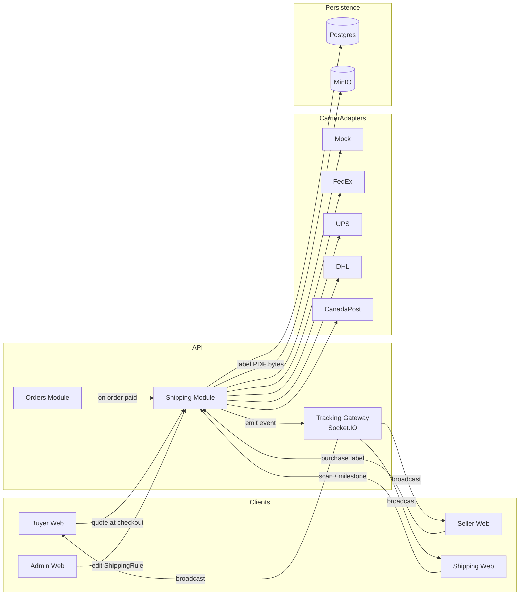
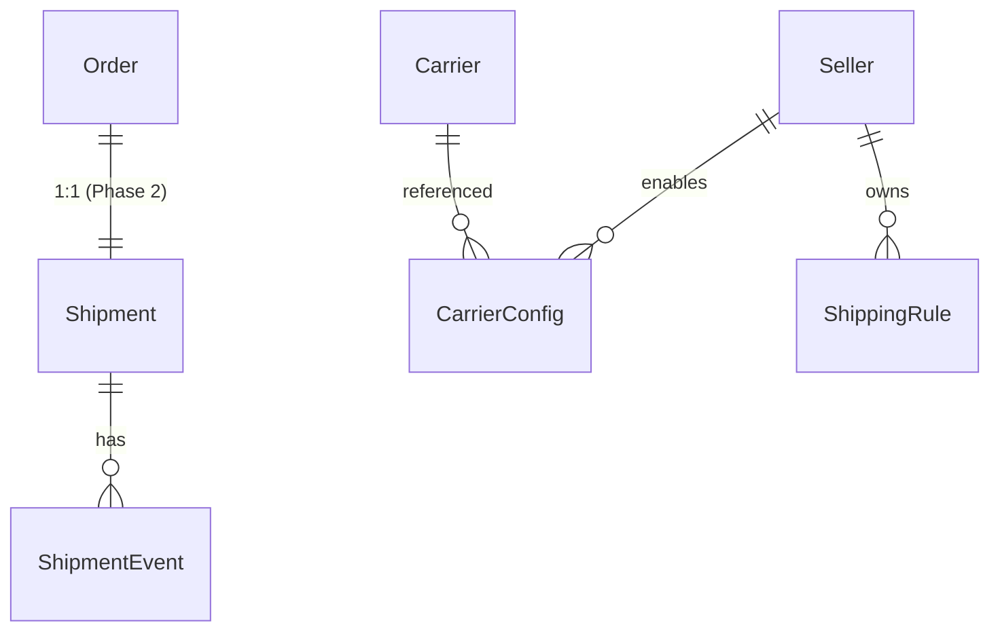
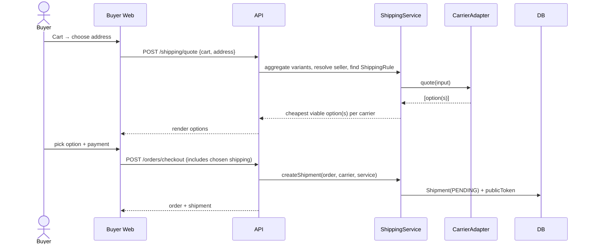
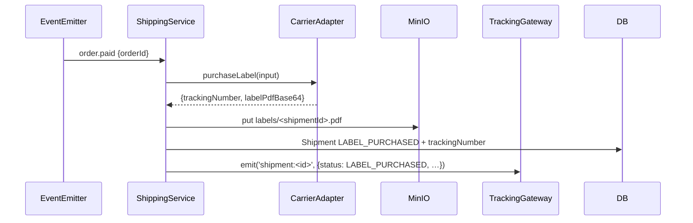

# Phase 2 — Shipping & Logistics

> Companion: [`master-plan.md`](./master-plan.md), [`PROGRESS.md`](./PROGRESS.md), [`phase-2-debug.md`](./phase-2-debug.md)

## 1. Objectives

Turn the flat-rate shipping placeholder from Phase 1 into a **fully in-house shipping system** that:

1. Quotes real shipping rates at checkout, from one or more carriers the seller and admin have enabled.
2. Generates a printable, carrier-formatted **shipping label PDF** the seller can stick on a box.
3. Hands those boxes off to logistics partners via a dedicated portal (pickup queue, scan, milestone updates).
4. Pushes tracking milestones **in real time** to the buyer (and the seller portal) over WebSockets.
5. Lets the buyer follow a package on a public tracking page from any device with no login.

## 2. Scope

### Must-have
- `CarrierAdapter` interface + `MockCarrier` (always-on) so dev works without keys.
- Real adapters for **FedEx**, **UPS**, **DHL Express**, **Canada Post** — credential-gated; auto-fallback to mock pricing when keys are absent.
- New Prisma models: `Shipment`, `ShipmentEvent`, `ShippingRule`, `CarrierConfig`.
- Quote endpoint surfaced to buyer-web checkout; Phase 1's flat-rate path still works as a safe fallback.
- Server-side PDF label generation (pdfkit) — single-page, carrier-compliant layout.
- `apps/shipping-web` portal (Next.js, port `3003`): pickup queue, scan-to-confirm, milestone updates.
- Public buyer tracking page at `/track/[token]` (no auth).
- Socket.IO gateway with rooms per shipment for live milestone broadcasts.
- Admin `ShippingRule` editor (per-seller carrier allow-list, weight bands, free-shipping threshold).

### Nice-to-have
- Carrier webhook ingestion endpoints (parsed, normalized into `ShipmentEvent`).
- "Reprint label" affordance for sellers.

### Deferred
- Customs declarations + HSN code wiring (lands in Phase 5).
- Cross-border tax/duty calc (Phase 6).
- Multi-package shipments per order (kept single-package per shipment until a Phase 4 reshipping flow).

## 3. Architecture



### Decisions

- **D-011:** Quotes are computed at checkout time and **snapshotted on `Order.shippingMinor`** plus a chosen `Shipment.carrier` + `Shipment.serviceLevel`. Carrier rates can drift; the buyer is charged what we showed.
- **D-012:** A `Shipment` belongs to an `Order` 1:1 in Phase 2. The schema is forward-compatible with 1:N (FK is on Shipment) for the Phase 4 split-shipment work.
- **D-013:** Labels are rendered with **pdfkit** (pure Node, no headless Chromium) — smaller container, faster cold start.
- **D-014:** Live carrier mode is opt-in per carrier via env (`FEDEX_API_KEY` etc.). When absent, the adapter returns deterministic mock rates so the whole flow stays runnable in dev.
- **D-015:** Public tracking is by **unguessable token** (256 bits, base64url) stored on `Shipment.publicToken`. No buyer-side auth required to follow a parcel.

## 4. Domain Additions



### New tables (excerpt)

- **Carrier** (lookup): `code (PK)`, `displayName`, `globallyEnabled`
- **CarrierConfig**: `id`, `sellerId`, `carrierCode`, `enabled`, `accountNumber?`, `serviceLevels (jsonb)`, `createdAt`
- **ShippingRule**: `id`, `sellerId`, `name`, `priority`, `minWeightGrams`, `maxWeightGrams?`, `destinationCountries (string[])`, `flatRateMinor?`, `freeAboveMinor?`, `carrierCodeWhitelist (string[])`, `enabled`
- **Shipment**: `id`, `orderId (unique)`, `carrierCode`, `serviceLevel`, `status (PENDING|LABEL_PURCHASED|PICKED_UP|IN_TRANSIT|OUT_FOR_DELIVERY|DELIVERED|EXCEPTION|CANCELLED)`, `trackingNumber?`, `labelObjectKey?`, `weightGrams`, `costMinor`, `currency`, `publicToken (unique)`, `purchasedAt?`, `deliveredAt?`, timestamps
- **ShipmentEvent**: `id`, `shipmentId`, `code (string)`, `label (string)`, `description?`, `locationCity?`, `locationCountry?`, `occurredAt`, `raw (jsonb)`, `source (CARRIER|PARTNER|ADMIN)`

## 5. Carrier Adapter Contract

```ts
interface CarrierAdapter {
  readonly code: CarrierCode; // 'fedex' | 'ups' | 'dhl' | 'canadapost' | 'mock'
  readonly displayName: string;

  quote(input: QuoteInput): Promise<QuoteResult[]>;       // 0+ service-level options
  purchaseLabel(input: PurchaseInput): Promise<LabelResult>;
  track(trackingNumber: string): Promise<NormalizedEvent[]>;
  parseWebhook(rawBody: Buffer, headers: Record<string, string | string[] | undefined>): NormalizedEvent[];
  cancel?(trackingNumber: string): Promise<void>;
}
```

Inputs include `originAddress`, `destinationAddress`, `weightGrams`, `dimensionsCm?`, `currency`, `serviceLevel?`.

All adapters fall through to a deterministic mock pricing function in **dev mode** (env keys absent), so every code path is exercisable without contacting a real carrier.

## 6. Checkout flow (updated)



After payment captures (`order.paid`), `ShippingService.purchaseLabel` runs in a worker:



## 7. Wire Diagrams

### Buyer tracking page
```
+--------------------------------------------------+
| Onsective tracking                               |
+--------------------------------------------------+
| Order #…48f2                Estimated: May 21    |
| Carrier: FedEx Ground       Tracking: 7945…      |
|                                                  |
| ●─────●─────●─────●─────○                       |
| Label  Pickup In   Out for Delivered             |
|        done  transit delivery                    |
|                                                  |
| Timeline                                         |
|  ▣ 2026-05-17 14:02  Label purchased            |
|  ▣ 2026-05-17 18:31  Picked up — Mumbai          |
|  ▢ ...                                           |
+--------------------------------------------------+
```

### Shipping partner portal — Pickup queue
```
+--------------------------------------------------+
| Onsective Shipping                  partner@org  |
+--------------------------------------------------+
| Pickup queue (12)         [ Scan a label ]       |
|  #...48f2 · FedEx Ground · 2.4 kg  [Confirm]     |
|  #...c91d · UPS Saver    · 0.6 kg  [Confirm]     |
|  …                                               |
+--------------------------------------------------+
| Update milestone for shipment #…48f2             |
|  (•) In transit  ( ) Out for delivery            |
|  Location  [Mumbai, IN]   When  [now]            |
|  [ Push update ]                                 |
+--------------------------------------------------+
```

## 8. Acceptance Criteria

- `GET /shipping/quote` returns one or more options for a cart + destination address; falls back to mock when no carrier creds are present.
- Checkout commits the chosen quote onto the resulting `Order` + `Shipment`.
- After `order.paid`, a label PDF is generated and stored in MinIO; the seller portal exposes a download link.
- A shipping-partner user can sign in to `:3003`, see the pickup queue, scan or click to confirm pickup, and push milestone updates.
- The buyer can open `/track/<token>` (no login) and see live status; pushes arrive without a manual refresh.
- Admin can create/edit/delete `ShippingRule` rows per seller and toggle carriers per seller via `CarrierConfig`.

## 9. Risks & Mitigations

| Risk | Mitigation |
| --- | --- |
| Carrier API outage during checkout | `quote` runs adapters in parallel; if all real adapters fail we surface the mock-priced rule-based quote and tag it `degraded: true`. |
| Label PDF rendering blocking the request | Label purchase happens asynchronously after `order.paid`. The buyer never waits. |
| Tracking spoof | Public token is 256-bit random; events from partner portal are only accepted from authenticated `SHIPPER` accounts; carrier webhooks verify signatures per adapter. |
| Tokenized URL leak | Token grants **read-only** access. No PII beyond ship-to city is exposed on the tracking page. |
| Stale rate vs charged amount | Rate is snapshotted to `Order.shippingMinor` at checkout. Re-quoting later does not retroactively charge. |
