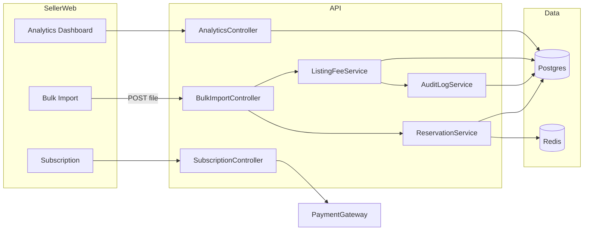
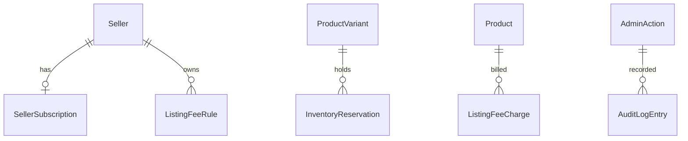

# Phase 3 — Seller Power Tools

> Companion: [`master-plan.md`](./master-plan.md), [`PROGRESS.md`](./PROGRESS.md), [`phase-3-debug.md`](./phase-3-debug.md)

## 1. Objectives

Turn the seller portal from a single-product authoring tool into a real merchant workspace:

1. **Bulk listing**: a seller can upload a CSV/XLSX of dozens or hundreds of products in one shot and get a row-level validation report.
2. **Inventory reservations**: adding to cart soft-holds stock for 15 minutes, so two buyers don't race for the last unit.
3. **Subscription tiers**: BASIC (free), PRO ($29/mo), ENTERPRISE ($199/mo). Tier-gated features via a `SubscriptionGuard`.
4. **Listing-fee engine**: per-seller / per-category fixed fees, deducted on product publish, with an audit log.
5. **Analytics**: revenue, AOV, conversion, top SKUs — pulled by the seller dashboard from materializable aggregates.
6. **Audit log**: every admin-side fee/tier/commission change becomes an immutable `AuditLogEntry` row.

## 2. Scope

### Must-have
- Prisma models: `SellerSubscription`, `InventoryReservation`, `ListingFeeRule`, `ListingFeeCharge`, `AuditLogEntry`
- Subscription module: `SubscriptionService`, `SubscriptionGuard`, `/seller/subscription/*` endpoints reusing the `PaymentGateway` abstraction (no second integration)
- Reservation system: integrated into `CartService.addItem/update/remove` and `OrdersService.checkout`; nightly sweeper for expired reservations
- Bulk import: `/seller/products/bulk-import` accepts a multipart upload (CSV today, XLSX-ready), returns a per-row report; commit-on-validate
- Listing-fee engine: `ListingFeeService.chargeOnPublish`, hooked from `SellerService.createProduct`
- Analytics: `/seller/analytics/summary` and `/seller/analytics/top-skus` (raw aggregations); admin-side reporting reuses
- Audit log: `AuditLogService.record(actor, action, entity, before, after)` plumbed through admin write paths
- `apps/seller-web`: bulk-import page, analytics dashboard, subscription/billing page
- `apps/admin-web`: listing-fee rule editor, subscription-tier config viewer, audit log

### Nice-to-have
- Variant matrix editor (toggle attribute × value grid → variants). Shipped behind a `PRO`+ feature gate.
- Export of audit log to CSV.

### Deferred
- XLSX parsing (Phase 6 — adds `exceljs` then). CSV covers >90% of bulk-import volume.
- ES-backed analytics with materialized views (Phase 6).
- Recurring billing cron for subscriptions — Phase 4 ties this into the payout pipeline.
- Sponsored listings / banners (Phase 4).

## 3. Architecture



### Decisions

- **D-016:** Reservations are stored in **Postgres** (`InventoryReservation` row) and indexed by `(variantId, expiresAt)`. Redis is used only for the sweeper's lock to avoid two API replicas double-releasing the same row.
- **D-017:** Effective inventory exposed to buyers = `variant.inventoryQty - SUM(active_reservation.qty)`. A read-only view `v_effective_inventory` would speed this up at scale (Phase 6).
- **D-018:** Subscriptions reuse `PaymentGateway.createIntent`. On `payment_captured` for a subscription intent, `SubscriptionService.activate(sellerId, tier, periodEnd)` flips the row.
- **D-019:** Listing-fee resolution order: per-seller override → per-category override → platform default → zero. Each fee charge writes a `ListingFeeCharge` row carrying the resolved-rule snapshot so historical charges are queryable even after rule edits.
- **D-020:** `AuditLogEntry` is **append-only** at the DB level (no update column exposed). Storage of `before`/`after` is JSONB diffs; an admin UI shows pretty-printed deltas.
- **D-021:** Bulk import is **transactional per product** — a row failure does not roll back successful rows. The validation phase runs first; if any error appears, the controller returns the report without writing anything (the seller can fix and retry).

## 4. Domain Additions



- **SellerSubscription**: `id`, `sellerId (unique)`, `tier (BASIC|PRO|ENTERPRISE)`, `status (ACTIVE|PAST_DUE|CANCELLED)`, `currentPeriodEnd`, `lastPaymentId?`, timestamps
- **InventoryReservation**: `id`, `variantId`, `cartId`, `qty`, `expiresAt`, `releasedAt?`, timestamps. Unique on `(cartId, variantId)`.
- **ListingFeeRule**: `id`, `sellerId? (null = platform-wide)`, `categoryId? (null = any)`, `amountMinor`, `currency`, `enabled`, timestamps. Priority: seller+category > seller > category > platform.
- **ListingFeeCharge**: `id`, `sellerId`, `productId`, `ruleId?`, `amountMinor`, `currency`, `chargedAt`, `note?`
- **AuditLogEntry**: `id`, `actorUserId`, `action (string)`, `entityType`, `entityId`, `before (jsonb)`, `after (jsonb)`, `createdAt`. Indexed on `(entityType, entityId)` and `actorUserId`.

## 5. API Surface (additions)

```
POST   /seller/products/bulk-import           multipart: file (CSV/XLSX), header: x-dry-run?
GET    /seller/analytics/summary              q: range=7d|30d|90d
GET    /seller/analytics/top-skus             q: range=...&limit=10
GET    /seller/subscription
POST   /seller/subscription/start             body: { tier, paymentProvider }
POST   /seller/subscription/cancel
GET    /admin/listing-fees                    q: sellerId?
POST   /admin/listing-fees                    body: rule
PATCH  /admin/listing-fees/:id
DELETE /admin/listing-fees/:id
GET    /admin/subscription-tiers
GET    /admin/audit-log                       q: actorUserId?&entityType?&entityId?
```

## 6. Sequence — Bulk Import

```mermaid
sequenceDiagram
    actor S as Seller
    participant W as Seller Web
    participant A as API (BulkImport)
    participant DB as Postgres

    S->>W: Upload products.csv
    W->>A: POST /seller/products/bulk-import {dryRun=true}
    A->>A: parse + validate each row
    A-->>W: report { rows[], errors[] }
    S->>W: Fix / approve
    W->>A: POST /seller/products/bulk-import {dryRun=false}
    A->>DB: BEGIN per row; on commit: ListingFeeService.chargeOnPublish
    A-->>W: report { created[], failed[] }
```

## 7. Wire Diagrams

### Seller bulk import
```
+----------------------------------------------------+
| Bulk import                                        |
+----------------------------------------------------+
|  [ Choose file (CSV) ]   [ Download template ]     |
+----------------------------------------------------+
| Dry-run report                                     |
|  Row 1 ✓  Aurora Earbuds                           |
|  Row 2 ✗  Halcyon Throw  · sku duplicate           |
|  Row 3 ✓  Meridian Crew                            |
|                                                    |
| [ Re-validate ]   [ Publish 2 valid rows ]         |
+----------------------------------------------------+
```

### Seller analytics
```
+----------------------------------------------------+
| Last 30 days                                       |
|  Revenue  $12,480     Orders 96   AOV $130.00      |
|  Conversion 2.4%      Refunds 1                    |
+----------------------------------------------------+
| Top SKUs                                           |
|  1. AWE-ONYX   $4,212  · 28 units                  |
|  2. MMC-CHA-M  $1,840  · 16 units                  |
|  …                                                 |
+----------------------------------------------------+
```

### Subscription
```
+----------------------------------------------------+
| Current tier: BASIC                                |
|                                                    |
| ▢ BASIC      free      ▣ PRO   $29/mo  ▢ ENT $199/mo |
| Bulk import ✓✓✓        Analytics ✓✓✓               |
| Variant matrix  ✗✓✓    Listing fee override ✗✗✓    |
|                                                    |
| [ Upgrade to PRO ]                                 |
+----------------------------------------------------+
```

## 8. Acceptance Criteria

- Seller uploads a CSV with five products: dry-run report flags the duplicate-SKU row; non-dry-run commits the four valid rows and rejects the offender.
- Adding to cart inserts an `InventoryReservation`; the same variant displays `inventoryQty - reserved` to other shoppers.
- Cart abandonment older than 15 minutes triggers release on next sweep.
- Subscribing to PRO via mock payment instantly flips `SellerSubscription.tier` to `PRO` after capture.
- Publishing a product writes a `ListingFeeCharge` row matching the resolved `ListingFeeRule`.
- Editing a commission % from the admin portal writes an `AuditLogEntry` containing the before/after value.
- The seller dashboard renders revenue, AOV, orders, and top SKUs for the last 7/30/90 days.

## 9. Risks & Mitigations

| Risk | Mitigation |
| ---- | ---------- |
| Reservation sweeper double-running across two API replicas | Redis `SETNX` lock with 60s TTL around the sweeper |
| Bulk import causing a giant TX that locks the products table | One TX per row, not per file |
| Listing-fee changes silently re-charging old products | Fees are computed and snapshotted **only at publish time**; rule edits never re-bill historical rows |
| Subscription downgrade losing PRO-tier data | Downgrades are soft; tier flips but no listings/data are deleted |
| Analytics queries blocking transactional traffic | Aggregations are read-only and hit the same DB in Phase 3; a read-replica/materialized-view upgrade is queued for Phase 6 |
