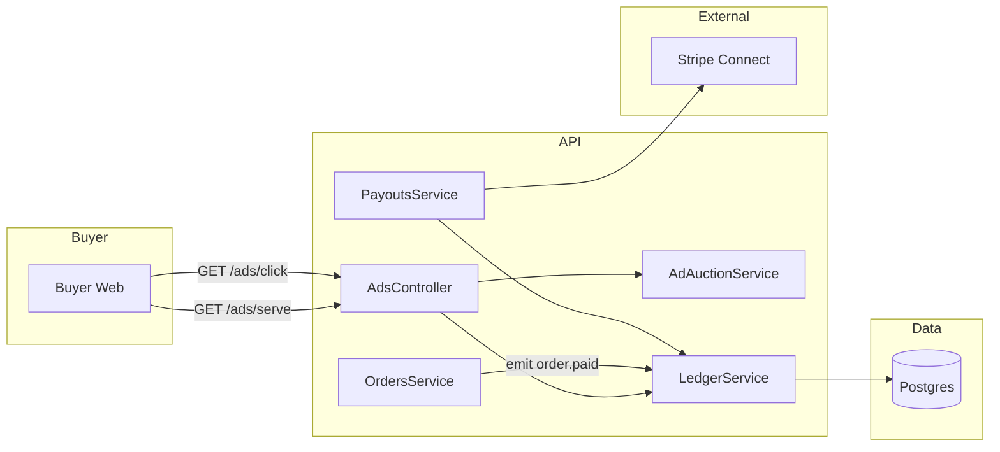
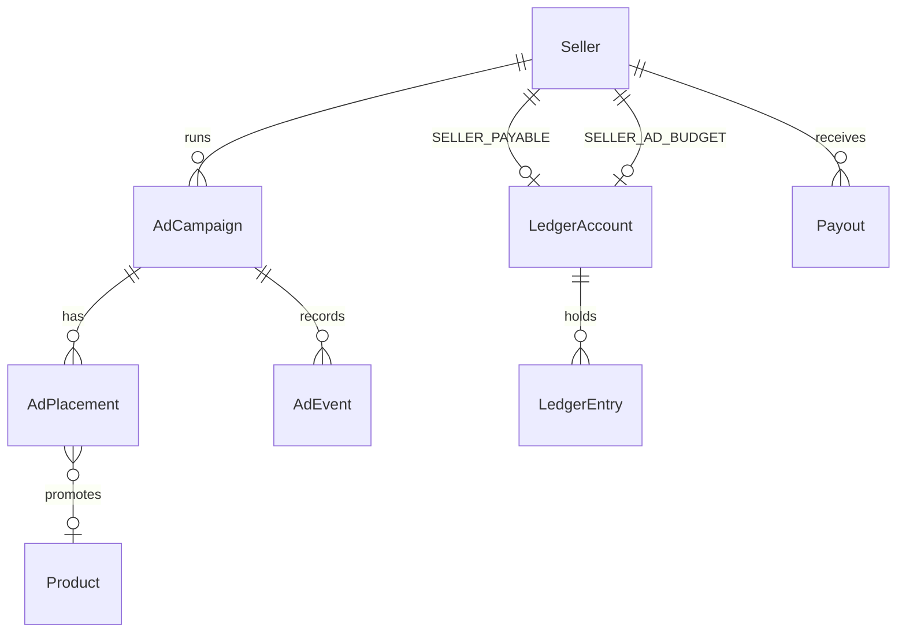

# Phase 4 — Revenue & Advertising

> Companion: [`master-plan.md`](./master-plan.md), [`PROGRESS.md`](./PROGRESS.md), [`phase-4-debug.md`](./phase-4-debug.md)

## 1. Objectives

Turn Onsective into a multi-stream revenue platform with auditable money flow:

1. **Sponsored placements** — sellers create campaigns (CPC or CPM), bid for placement, and we serve the highest-EV ad in three slot types: sponsored-product, search-sponsor, banner.
2. **Double-entry ledger** — every dollar that moves (order paid, commission booked, ad click charged, payout sent, refund issued) writes balanced `LedgerEntry` rows so platform revenue, seller balances, and ad budget remain provably consistent.
3. **Payout pipeline** — nightly job aggregates each seller's payable balance and issues payouts via **Stripe Connect** (when wired) or a **manual** workflow that admin completes off-platform.
4. **Admin revenue dashboard** — GMV, take-rate, ad revenue, payouts due/sent, top-spending advertisers.

## 2. Scope

### Must-have
- Models: `AdAsset`, `AdCampaign`, `AdPlacement`, `AdEvent`, `LedgerAccount`, `LedgerEntry`, `Payout` (+ enums)
- Ads engine:
  - Campaign CRUD per seller (gated by `SubscriptionGuard` for some tiers? No — ad spend is independent of tier.)
  - `AdAuctionService.resolve(slot, context)` → best campaign for a slot, honoring daily/total budgets
  - `/ads/impression` and `/ads/click` endpoints; the click route is a 302 redirect to the destination URL and charges CPC
  - CPM billing computed at the impression endpoint
- Ledger:
  - `LedgerService.post(txnId, entries)` — rejects unbalanced postings
  - Account upsert by `(kind, sellerId, currency)`
  - Helpers: `bookOrderPaid`, `bookOrderRefunded`, `bookAdCharge`, `bookAdTopUp`, `bookPayout`
- Payouts:
  - `PayoutsService.computeForSeller(sellerId, periodEnd)` — payable = sum(seller-payable credits) - sum(payout debits) - sum(refunds) - sum(ad charges debited from seller-payable)
  - `PayoutsService.execute(payoutId)` — Stripe Connect transfer when configured; manual otherwise (admin flips status PAID)
  - Cron: simple in-process daily timer; production replaces with BullMQ in Phase 6
- Commission booking: `OnEvent('order.paid')` posts the ledger; `OnEvent('order.refunded')` reverses
- `apps/seller-web`: ads dashboard (campaigns table, create form, top-up modal)
- `apps/buyer-web`: sponsored row on home + sponsor card on search results page; impression beacon on render, click→302→PDP
- `apps/admin-web`: revenue dashboard, payouts queue with mark-paid

### Nice-to-have
- Banner placements with media uploads (deferred to Phase 5 once we have native uploads)
- Variant matrix editor from Phase 3 (deferred again — keep Phase 4 ad-focused)

### Deferred
- Multi-currency ledger reporting (Phase 6)
- BullMQ-backed cron (Phase 6)
- Ad fraud/quality scoring (post-launch)

## 3. Architecture



### Decisions

- **D-022:** Every money-moving operation calls `LedgerService.post(txnId, entries)` which fails atomically if `sum(DEBIT) !== sum(CREDIT)`. No partial-postings ever land in the table.
- **D-023:** Ad budgets are **pre-paid**. A seller "tops up" by buying credit (`bookAdTopUp` debits a payment receivable account, credits `SELLER_AD_BUDGET`). Clicks/impressions debit `SELLER_AD_BUDGET` and credit `PLATFORM_AD_REVENUE`.
- **D-024:** The auction is **scored at request time** using a sorted-set per slot: `score = bidMinor * weight`. We don't precompute placements; the live query is `O(active campaigns matching the slot)` which is small at launch scale.
- **D-025:** Payouts use the **fundamental accounting identity**: `payable = credits - debits` against `SELLER_PAYABLE/<sellerId>`. The compute pass joins ledger entries with the period bounds; the payout itself emits its own balancing entry (debit `SELLER_PAYABLE`, credit `PAYOUT_SENT`).
- **D-026:** **Idempotency**: every ad event carries a client-generated `eventId`; duplicate posts return the existing entry. Payouts have `(sellerId, periodEnd)` unique to prevent double payment.

## 4. Domain Additions



## 5. Auction algorithm (excerpt)

```ts
function score(c: AdCampaign): number {
  if (c.status !== 'ACTIVE') return -Infinity;
  if (c.endsAt && c.endsAt < now) return -Infinity;
  if (c.totalBudgetMinor > 0 && c.spentMinor >= c.totalBudgetMinor) return -Infinity;
  if (c.dailyBudgetMinor > 0 && spentToday(c) >= c.dailyBudgetMinor) return -Infinity;
  return c.bidMinor * c.priority;
}
```

The slot returns the top-scored campaign + a single `placement` to render.

## 6. Wire diagrams

### Seller ads dashboard
```
+--------------------------------------------------+
|  Campaigns                  [ + New campaign ]   |
+--------------------------------------------------+
|  Aurora Earbuds       CPC $0.45  Spent $128.50  |
|     Sponsored product · ACTIVE · 320 clicks      |
|  ----                                            |
|  Halcyon Throw        CPM $4.00  Spent $42.10   |
|     Search sponsor "throw" · PAUSED              |
+--------------------------------------------------+
| Ad balance: $182.40   [ Top up ]                 |
+--------------------------------------------------+
```

### Admin revenue dashboard
```
+--------------------------------------------------+
| Last 30 days                                     |
|  GMV $48,210   Commission $7,231  Ad revenue $912 |
|  Take rate 16.9%                                 |
+--------------------------------------------------+
|  Payouts due                                     |
|  Sharma Stores  $1,892.00  [Run] [Mark paid]     |
+--------------------------------------------------+
```

## 7. Acceptance Criteria

- A seller creates a CPC campaign with a sponsored-product placement; the buyer-web home shows the product in a "Sponsored" row; clicking redirects via `/ads/click/:id` and charges the campaign.
- A second seller bidding higher on the same slot wins until budget exhausted; daily budget caps are honored.
- An order capture writes a balanced `LedgerEntry` group: gross splits into `SELLER_PAYABLE` (net) + `PLATFORM_REVENUE` (commission); a subsequent refund posts an exact reversal sharing the same `refId`.
- Admin sees revenue dashboard with GMV / commission / ad revenue / payouts due, and can mark a `MANUAL` payout PAID.
- `PayoutsService.run()` computes per-seller balances, creates `Payout` rows with status `PENDING`, ledger entries debit `SELLER_PAYABLE` + credit `PAYOUT_SENT`.

## 8. Risks & Mitigations

| Risk | Mitigation |
| ---- | ---------- |
| Unbalanced ledger postings | `LedgerService.post` rejects when DEBITs != CREDITs in the same txn; integration tests would assert balance after every flow |
| Double-charging on duplicate click POSTs | Idempotency key on `AdEvent` |
| Payout race (two cron pods) | `Payout.uniqueIndex(sellerId, periodEnd)` |
| Stripe Connect not wired in dev | `MANUAL` payout method is the default; admin completes off-platform and marks PAID |
| Refund posted before commission booked | Both flows attempt to upsert accounts; refund's posting uses the same account ids; if no original posting exists, the refund still records but it's flagged in the admin dashboard |
